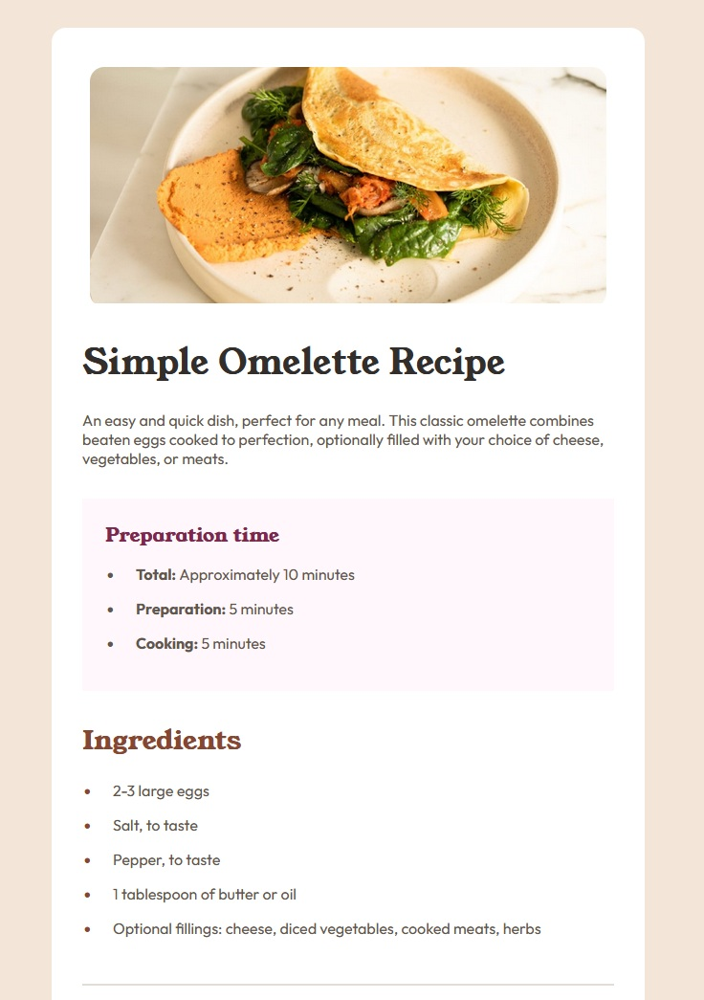

# Frontend Mentor - Recipe page solution

This is a solution to the [Recipe page challenge on Frontend Mentor](https://www.frontendmentor.io/challenges/recipe-page-KiTsR8QQKm). Frontend Mentor challenges help you improve your coding skills by building realistic projects. 

## Table of contents

- [Overview](#overview)
  - [Screenshot](#screenshot)
  - [Links](#links)
- [My process](#my-process)
  - [Built with](#built-with)
  - [What I learned](#what-i-learned)
  - [Useful resources](#useful-resources)

## Overview

### Screenshot

### Links

- Solution URL: [https://github.com/thenotoriousob/recipe-page]
- Live Site URL: [https://euphonious-banoffee-e57e72.netlify.app/]

### Built with

- Semantic HTML5 markup
- SAAS
- Mobile-first workflow

### What I learned

- This project has just followed on from the last with me continuing to use SAAS
- This project involved a bit of responsive design the other projects didn't
- I started using GitKraken as my tool for interacting with Git and it seems like an excellent interface

### Useful resources

- [Beginners guide to SASS](https://www.freecodecamp.org/news/the-beginners-guide-to-sass/) - This gave me an initial understanding of how SASS works
- [SASS tutorial](https://www.geeksforgeeks.org/sass/) - This went into SASS in a bit more detail and enhanced my understanding
